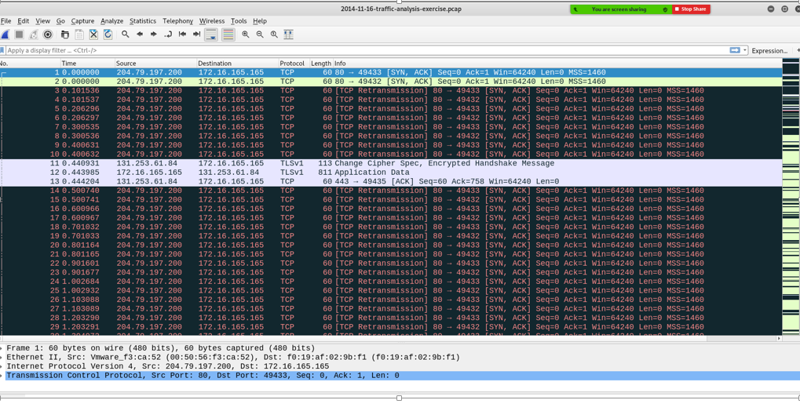
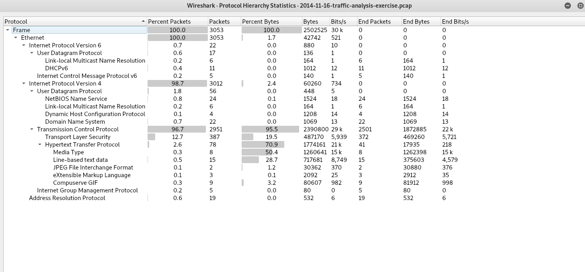
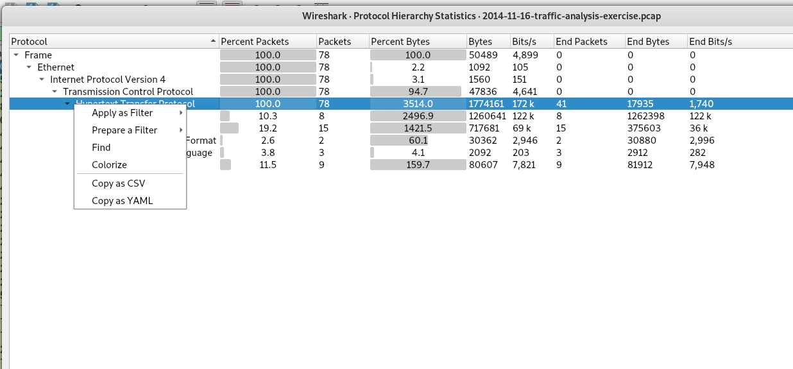
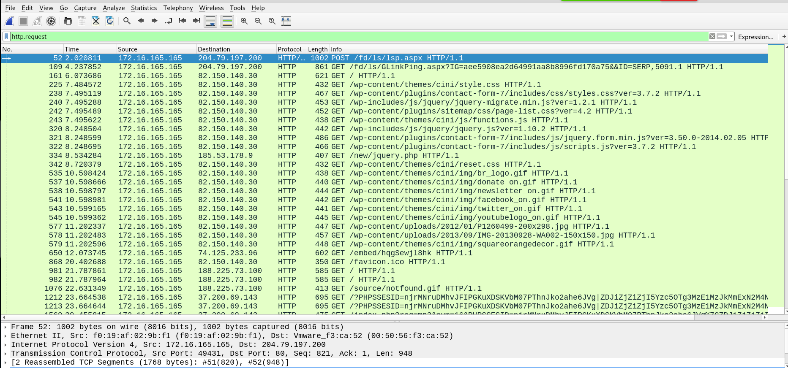
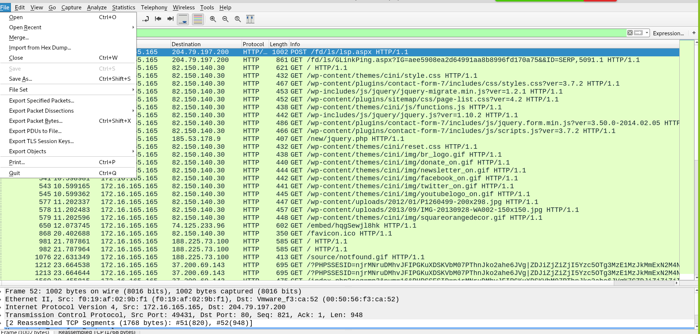
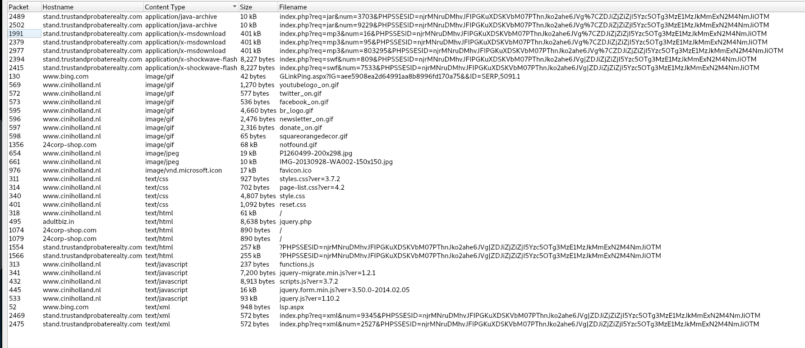
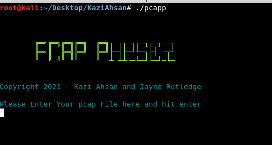
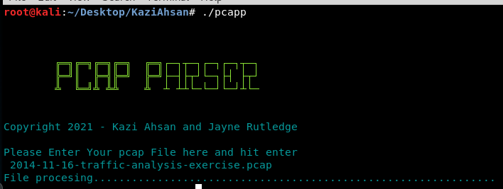
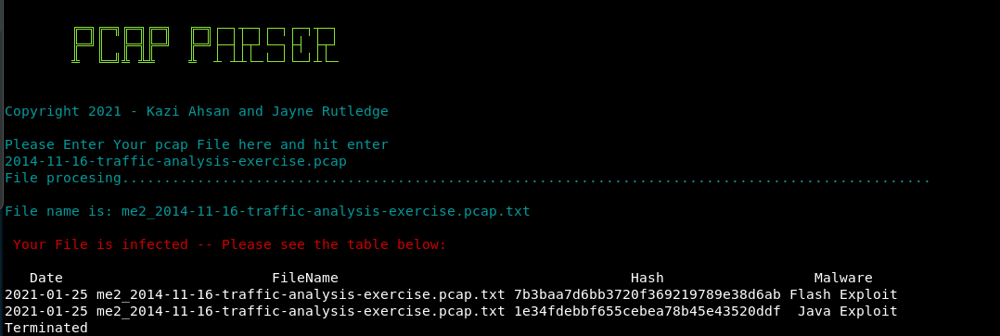

# PCAP-Parser

<b>PCAP Parser Project by Kazi Ahsan and Jayne Rutledge                  Date: 1/23/2021</b>

***

## So where do we begin?

1. **Network Analysis** with Wireshark

   -- First we want to export http objects from wireshark into a pcap file to see if they may be malicious. 

2. **PCAP-Parser Software** with Python and Bash 

   -- Now we are going to parse the PCAP file through our software to see if there are any known viruses – 

3. **Export and Append** to a .csv File

   -- Create an excel file and save it as FromPython.csv (If you want to change the name of the .csv file you need to go to the md5parser.py file and change it within the file).

## **Network Analysis** with Wireshark

  
How Network Analysis with Wireshark works

  -We are using a pcap file from malware-analysis-traffic.net to generate network traffic for this scenario. 
 

 -The first thing we will do is go up to Statistics, to Protocol Hierarchy to see what protocols are being used in this pcap. We are interested in TCP application traffic.
 - We can see that there is a lot of HTTP which is related to web traffic.

 
 -We will select a filter to return only on layer 7, HTTP protocol. 
 

 -For this demonstration, we are interested in retrieving GET and POST requests for now. So we type in http.request. 

 
 -To get the actual file we need to go to File, Export Objects, and HTTP.
 

 -We can now see all the file objects that were downloaded in this packet capture. We then sort by Content Type. In this save we see gifs, and text and applications. 
 -In this example, there are three different types of Applications which appear suspicious we will look at: java, Microsoft executable download and shockwave-flash. 
 -I’m going to save this PCAP file in the same folder with my other two md5parser and pcap parser file. 

*we use wireshark tools to do that.*

## **PCAP-Parser Software** with Python and Bash 
 

 

<b>What is an our PCAP Parser software and why would anyone use it?</b>

The location of the scripts can be found at: (https://github.com/KaziSAhsan/PCAP-Parser/blob/main/pcapp) 
(https://github.com/KaziSAhsan/PCAP-Parser/blob/main/md5parser.py)
1. Make sure you place them in the same directory. When you execute pcapp then this will call the md5parser.py and execute it. Before that you need to change your executable    permission to run this script. This will take less than 30 seconds to run this script. 
 

2. Right now our program is going to check the hashes for any known virus. By verifying the hashed signature to be malware we will then know the appropriate corrective actions to take. When we are parsing pcap data into our software, our software captures the packet data, sends it to a file that is the same as the pcap name. 

3. Then it converts data into hashes and compares them with some known malicious malware hashes that already exist in our software. When malicious software is run through our hashing program it produces a unique hash that identifies that malware (a sort of fingerprint).

## Export and Append to a .csv File

 

<b>How Export and appending works?</b>

Create an excel file and save it as FromPython.csv (If you want to change the name of the .csv file you need to go to the md5parser.py file and change it within the file)

### 

1. Once detected, the hash (es), malware, the infected file name, and the program run-date will be exported and appended to a .csv file. This file will hold all the records. 

.png)

    note my interface is eth0 and my MAC Address 08:00:27:23:ff:90

2. We can use this file (weekly/monthly) to analyze the data, and find out which pcap files are mostly infected, what kind of malware is attacking the most or how frequently we are getting a malware match.

